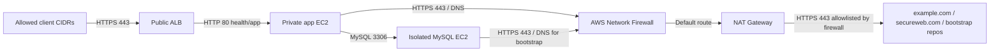

# PCI-DSS DevOps POC

This repository is a complete, runnable Terraform example for a DevOps candidate task.
It models a small AWS payment-provider environment and demonstrates how to address
PCI-DSS network isolation concerns around inbound and outbound access to the CDE
(cardholder data environment).

The original task is intentionally presented as a candidate exercise. This repository
shows one reasonable implementation level and the discussion material expected from a
strong candidate.

## What This Builds

- A dedicated VPC across three Availability Zones.
- Public subnets for an internet-facing Application Load Balancer and NAT Gateways.
- Private application subnets for a Linux app EC2 instance.
- Dedicated AWS Network Firewall subnets for managed egress inspection.
- Isolated database subnets for a Linux MySQL EC2 instance.
- Security groups with default outbound disabled and explicit least-privilege rules.
- HTTPS ALB ingress limited to a finite CIDR allowlist.
- App access only from the ALB security group.
- MySQL access only from the app security group.
- AWS Network Firewall domain allowlist for outbound HTTPS traffic required by the app.
- ACM certificate creation, DNS validation, and HTTPS termination on the ALB.

## Architecture

See [docs/diagram.md](docs/diagram.md).



## Requirements

- Terraform >= 1.10
- AWS credentials configured in your shell
- A public Route53 hosted zone for the application domain
- Permission to create VPC, EC2, ELBv2, ACM, Route53 records, Network Firewall, NAT Gateway, security group, and related resources

Terraform is not vendored in this repository.

## Quick Start

Create a local variable file:

```hcl
# terraform.tfvars
aws_region = "us-east-1"

allowed_ingress_cidrs = [
  "203.0.113.10/32"
]

domain_name = "app.example.com"
```

Then run:

```bash
terraform init
terraform plan
terraform apply
```

## GitHub Actions

The workflow in `.github/workflows/terraform.yml` runs:

- `validate` on pull requests and pushes to `main`.
- `plan` after validation, using AWS credentials from GitHub OIDC.
- `apply` only from manual `workflow_dispatch` when the `apply` input is set to `true`.

Configure these GitHub repository variables:

```text
AWS_REGION=us-east-1
TF_VAR_DOMAIN_NAME=app.example.com
TF_VAR_ALLOWED_INGRESS_CIDRS_JSON=["203.0.113.10/32"]
TF_VAR_HOSTED_ZONE_NAME=example.com
```

`TF_VAR_HOSTED_ZONE_NAME` is optional when the hosted zone can be derived from
`TF_VAR_DOMAIN_NAME`.

Configure this GitHub repository secret:

```text
AWS_ROLE_TO_ASSUME=arn:aws:iam::111122223333:role/github-terraform-poc
```

For real `plan` and `apply` runs, configure remote Terraform state. A commented S3
backend block is included in `versions.tf`; update it and uncomment it before using the
workflow against a shared AWS account.

Terraform creates an ACM certificate for `domain_name`, finds the public Route53 hosted
zone, creates the DNS validation record, waits for validation, and then attaches the
certificate to the ALB HTTPS listener. It also creates an alias A record from
`domain_name` to the ALB.

```hcl
domain_name = "app.example.com"
```

By default, the hosted zone name is derived from the domain name. For example,
`app.example.com` resolves to the public hosted zone `example.com`. If the hosted zone
is different, set only its name:

```hcl
hosted_zone_name = "dev.example.com"
```

## Why AWS Network Firewall?

AWS security groups cannot restrict outbound traffic by DNS name. The task requires
the app to reach `secureweb.com` over HTTPS and fetch a startup package from
`example.com`, while keeping the environment controlled.

For a production-style implementation, this repository keeps app and database instances
private and routes outbound traffic through AWS Network Firewall before it reaches NAT
Gateways. The firewall policy uses a stateful domain allowlist for TLS SNI and HTTP Host
matching, while security groups still restrict the instance-level ports that can leave
the workload.

Additional production improvements can include private package mirrors, golden AMIs,
VPC endpoints for AWS APIs, centralized firewall logging, and alerting on denied flows.

## PCI-DSS Mapping

This POC focuses on the spirit of PCI-DSS 1.3.1 and 1.3.2:

- No direct public access to systems in the CDE.
- Public ingress terminates at a controlled DMZ-style ALB.
- Inbound traffic is limited to explicitly authorized source CIDRs.
- Private instances accept traffic only from required security groups.
- Outbound traffic is not the default AWS "allow all"; it is explicitly routed through
  AWS Network Firewall and allowlisted by domain.

See [docs/audit-discussion.md](docs/audit-discussion.md) for the five-day audit fallback
discussion.

## Repository Layout

```text
.
├── README.md
├── terraform.tfvars.example
├── .github/
│   └── workflows/
│       └── terraform.yml
├── docs/
│   ├── audit-discussion.md
│   ├── candidate-task.md
│   └── diagram.md
├── user_data/
│   ├── app.sh.tftpl
│   └── db.sh.tftpl
├── versions.tf
├── variables.tf
├── locals.tf
├── network.tf
├── firewall.tf
├── security.tf
├── compute.tf
├── certificates.tf
├── load_balancer.tf
└── outputs.tf
```

## Notes For Candidates

The implementation is intentionally simple enough to discuss in an interview. A strong
candidate should be able to explain the trade-offs, especially around domain-based
egress control, certificate handling, managed firewall routing, the difference between
a POC and production, and how to reduce audit risk when rollout time is short.
