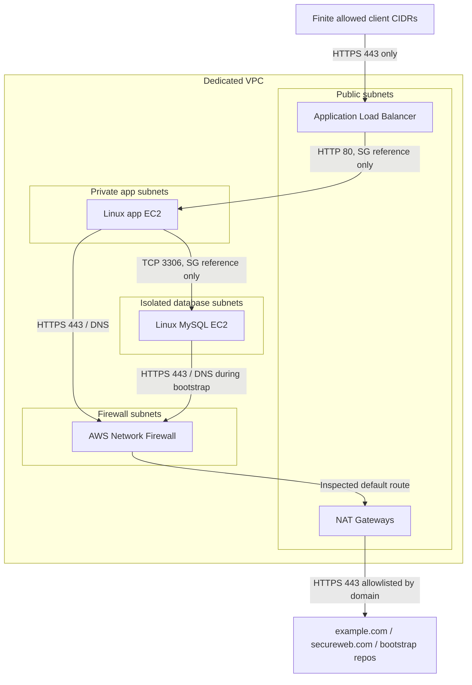

# PCI-DSS DevOps POC

Terraform example of a small AWS payment-provider environment
demonstrating PCI-DSS network isolation principles for inbound and
outbound traffic around a CDE (Cardholder Data Environment).

## What It Builds

-   3-AZ AWS VPC
-   Public subnets with ALB and NAT Gateways
-   Private application EC2 instance
-   Isolated MySQL database subnet
-   AWS Network Firewall for controlled egress
-   Least-privilege security groups (no default outbound access)
-   HTTPS ALB with ACM certificate and Route53 DNS validation
-   Restricted inbound access from approved CIDRs only
-   App → DB access limited by security groups
-   Domain-based outbound HTTPS allowlist

## Architecture



## Security Boundaries

- The ALB is the only public entry point.
- The app instance has no public IP address.
- The database instance has no public IP address.
- App and database security groups do not use default allow-all egress.
- External web traffic is routed through AWS Network Firewall with a domain allowlist.


## Requirements

-   Terraform \>= 1.10
-   AWS credentials configured
-   Public Route53 hosted zone
-   Permissions to create:
    -   VPC
    -   EC2
    -   ALB
    -   ACM
    -   Route53
    -   Network Firewall
    -   Security Groups

## Deployment

Example `terraform.tfvars`:

``` hcl
aws_region = "us-east-1"

allowed_ingress_cidrs = [
  "203.0.113.10/32"
]

domain_name = "app.example.com"
```

Run:

``` bash
terraform init
terraform plan
terraform apply
```

## GitHub Actions

Workflow performs:

-   `terraform validate` on pull requests and pushes
-   `terraform plan` using GitHub OIDC authentication
-   `terraform apply` only via manual workflow dispatch

Required repository variables:

``` text
AWS_REGION
TF_VAR_DOMAIN_NAME
TF_VAR_ALLOWED_INGRESS_CIDRS
TF_VAR_HOSTED_ZONE_ID
```

Required secret:

``` text
AWS_ROLE_TO_ASSUME
```

For shared environments configure remote Terraform state using S3
backend.

## Network Security Design

Security groups enforce workload isolation:

-   ALB → App: HTTP 80
-   App → Database: MySQL 3306
-   No unrestricted outbound access

AWS Network Firewall provides domain-based egress control because
security groups cannot filter traffic by DNS name.

Example allowed destinations:

-   `example.com`
-   `secureweb.com`

Traffic flow:

``` text
Private Workload
      |
AWS Network Firewall
      |
NAT Gateway
      |
Internet
```

## PCI-DSS Alignment

This implementation addresses PCI-DSS network isolation requirements:

-   No direct internet access to CDE workloads
-   Public access terminates at a controlled ALB layer
-   Inbound traffic restricted by approved CIDRs
-   Private resources communicate only through required paths
-   Outbound traffic inspected and allowlisted

## Repository Structure

``` text
.
├── terraform files
├── .github/
│   └── workflows/
├── docs/
├── user_data/
└── README.md
```
