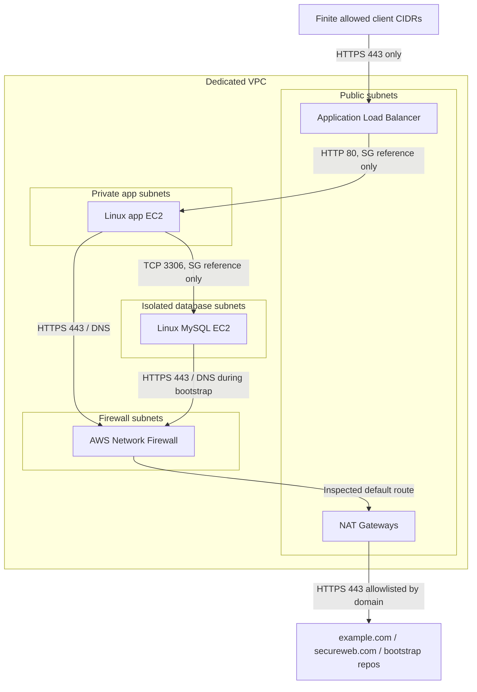

# POC Infrastructure Diagram

## Security Boundaries

- The ALB is the only public entry point.
- The app instance has no public IP address.
- The database instance has no public IP address.
- App and database security groups do not use default allow-all egress.
- External web traffic is routed through AWS Network Firewall with a domain allowlist.
